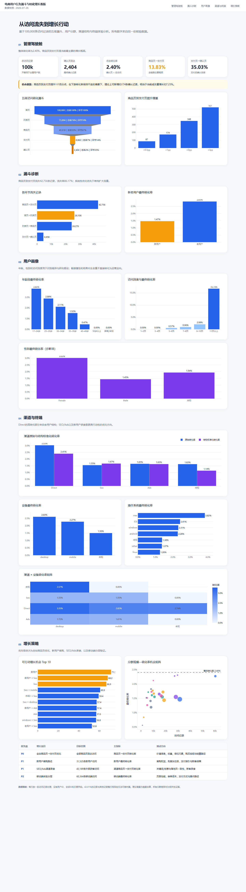
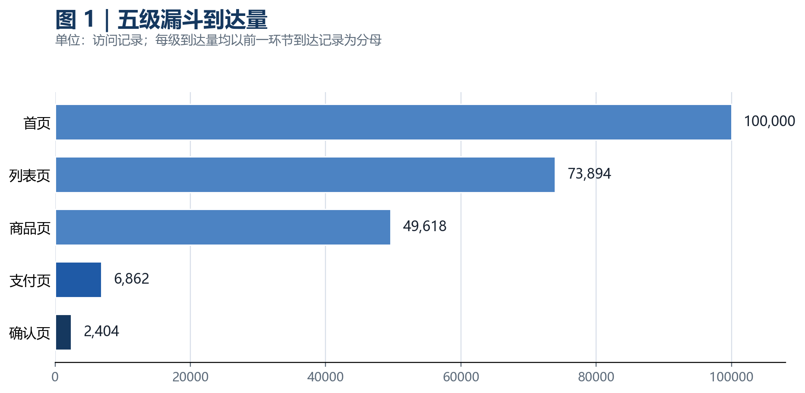
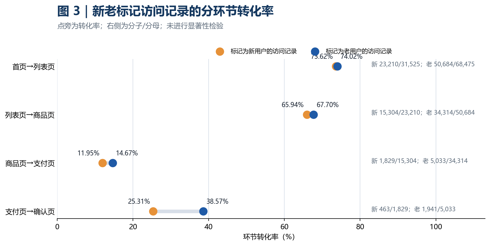
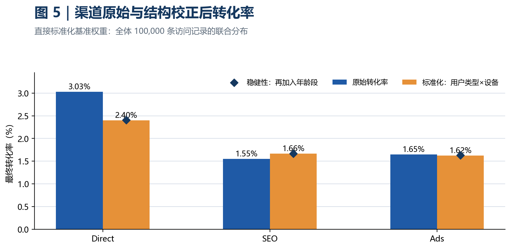

# 电商用户行为漏斗与转化增长分析

> 基于 100,000 条匿名访问记录，从数据治理、漏斗诊断、人群拆解和渠道校正出发，定位核心转化瓶颈，并将分析结果转化为可执行的增长实验。

[在线查看交互式看板](https://lulu04201226.github.io/ecommerce-user-behavior-analysis/) · [下载完整项目报告](report/电商用户行为漏斗与转化增长分析_项目报告.pdf)



## 项目概览

该项目模拟互联网业务中的转化增长分析场景。分析对象为匿名访问记录，不等同于去重用户。项目没有停留在描述性图表，而是沿着“数据是否可信—问题发生在哪里—哪些差异来自人群结构—应该先验证什么”的逻辑推进。

核心分析链路：

```text
数据治理 → 指标定义 → 五级漏斗 → 新老用户拆解
        → 渠道结构校正 → 增长优先级 → A/B 实验方案
```

## 核心发现

| 发现 | 量化结果 | 决策含义 |
|---|---:|---|
| 整体确认页转化率 | **2.40%** | 当前仍有明显转化提升空间 |
| 商品页 → 支付页 | **13.83%** | 绝对流失 **42,756** 条，是 P0 瓶颈 |
| 新用户最终转化率 | **1.47%** | 低于老用户的 **2.83%**，差距主要形成于商品页之后 |
| Direct 渠道 | 原始 **3.03%**，标准化后 **2.41%** | 原始优势部分来自老用户结构 |
| 核心环节提升 1pp | 约新增 **174** 条确认记录 | 相当于当前确认量提升约 **7.23%** |

## 分析思路

### 1. 数据治理

- 核对 100,000 条记录、13 个原始字段及五级漏斗顺序。
- 将分类字段中的 `0` 统一标记为“未知”，保留全部样本。
- 识别 2 条异常年龄记录并单独归类。
- 漏斗逆序校验结果为 **0 条**。
- 不因记录完全相同而直接去重：数据缺少 `user_id`、`session_id` 和时间戳，无法证明其为重复访问。

### 2. 漏斗定位

以首页、列表页、商品页、支付页和确认页构建五级漏斗，同时比较环节转化率、流失率和绝对流失量。商品页到支付页兼具较大前序规模和最大绝对流失，因此优先级高于单纯流失率较高但样本较小的环节。



### 3. 用户拆解

新老用户在漏斗前两步差异有限，差距主要在购买与支付阶段扩大。分析由此将新用户设为 P0 实验的预设观察分层，而不是事后筛选“表现最好”的人群。



### 4. 渠道校正

Direct 中老用户记录占 96.01%，SEO 与 Ads 则以新用户为主。项目使用全体样本的“用户类型 × 设备”联合分布作为统一权重，计算渠道结构标准化转化率，减少直接比较原始渠道结果造成的构成偏差。



Direct 标准化结果 2.41% 接近整体 2.40%，只是本次数据和权重组合后的数值结果，并不意味着标准化算法必然收敛到整体均值。

### 5. 严谨性修正

- 访问深度低于 5 页的分组在当前数据口径下属于结构性零值，不用于判断购买意愿。
- Direct、SEO、Ads 合计 99,877 条；其余 123 条为未知渠道，保留在整体指标中但不纳入渠道比较。
- 所有分组转化率需同时查看样本基数，避免将小样本 0% 解释为稳定业务规律。
- 分群和渠道差异来自观察性数据，不用于直接证明因果关系。

## 增长行动

| 优先级 | 行动 | 主指标 | 验收原则 |
|---|---|---|---|
| P0 | 商品页信息、信任元素、规格选择与购买入口组合实验 | 商品页 → 支付页转化率 | 达到预注册 MDE，置信区间排除 0，护栏指标不劣化 |
| P1 | 新用户首购权益与支付路径 | 新用户后两步转化率 | 新用户主指标提升，老用户及下游无方向性劣化 |
| P1 | SEO / Ads 落地页承接 | 渠道内商品页 → 支付页转化率 | 同时报告原始值、用户结构和标准化结果 |
| P2 | 移动端分层观察 | 分终端核心漏斗 | 仅在预注册交互成立后单独立项 |

## 仓库结构

```text
.
├─ README.md
├─ data/            # 数据接入说明，不公开来源未确认的完整原始数据
├─ src/             # 清洗、分析、图表与报告脚本
├─ analysis/        # 关键审计表与聚合分析结果
├─ assets/          # 报告图表和看板截图
├─ docs/            # GitHub Pages 交互式看板
├─ methodology/     # 指标、验证和质量检查说明
└─ report/          # 完整项目报告 PDF
```

## 本地复现

```bash
python -m venv .venv
.venv\Scripts\activate
pip install -r requirements.txt
```

将获得授权的数据文件放入 `data/raw/user_behavior.csv`，并根据 [数据接入说明](data/README.md) 完成字段映射，再按脚本编号运行：

```bash
python src/01_prepare_data.py
python src/02_analyze.py
python src/03_visualize.py
```

## 数据边界

- 每行代表一条匿名访问记录，不等同于独立用户。
- 缺少用户、会话和时间字段，无法计算 UV、留存、复购或时间趋势。
- 缺少订单金额、毛利和渠道成本，不能直接计算 GMV、利润或 ROI。
- 理论新增确认记录属于机会情景测算，不是上线效果承诺。
- 当前数据来源与公开许可证尚未确认，因此仓库不包含完整原始数据。

## 技术栈

`Python` · `pandas` · `NumPy` · `Matplotlib` · `Plotly` · `statsmodels` · `ReportLab`

## 作者

宋亭萱｜数据分析与互联网增长方向
